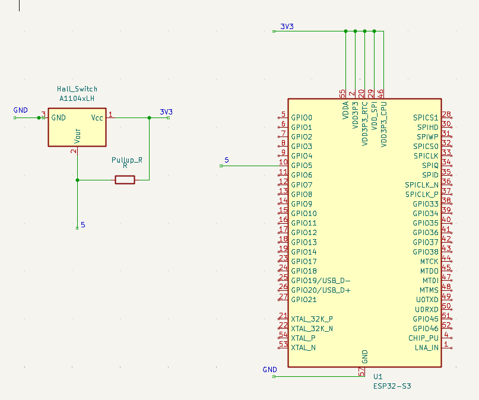

# Extended Low-Power Remote Door Lock Monitoring System, Based on the Status of the A3144 Hall Switch

## Core operational logic:

The A3144 Hall sensor is a typical digital output Hall sensor. It determines and maintains two states based solely on the distance between the magnet and the sensor: if it detects some magnet in a specific distance, the output will turn low and else the output will remain high. Although it cannot map specific magnetic field strengths, a binary output suffices to cover all conditions for door lock detection.

Experiments show that for a single 6.9 × 1.1 mm neodymium magnet, the trigger distance in air is approximately 4–5 mm.

## Communications:

During the initial design phase, door lock status changes are transmitted to the MQTT Server via Wi-Fi + MQTT, with another MQTT client application receiving these status updates. 

Since communication is only active when the door lock status changes, it remains idle most of the time. Moreover, under minimal yet sufficient requirements, communication only needs to transmit the binary status of a single door lock. Therefore, theoretically, the entire system can be maintained with extremely low data volume and communication frequency, offering significant potential for overall power consumption control. 

## Hardware Circuit design:

The hardware circuit consists of two fundamental components: the ESP32-S3 development kit, an A3144 Hall switch, The sensor and effector I/O pins will be connected to two ESP32 digital pins respectively and powered via the 3V3 pin. 

Users can add other effectors as needed, such as LED displays and buzzers, to provide sensory feedback on network connectivity or door lock status.

## Software Logical Design: 
The initial verification design was implemented using the Arduino IDE and the corresponding ESP32 library files.

The prototype includes both a synchronous and an asynchronous version of the MQTT library. Due to potential issues with the asynchronous MQTT library, the asynchronous version's code has not been verified for proper functionality.

Note: For Wi-Fi connection issues that may occur with the esp32-s3 DevKit, customizing the transmission power in the code can effectively resolve most cases of failed initial connection attempts.

The native compilation version by Espressif has more stable Wi-Fi, MQTT broker connection, and reconnection mechanisms. 

The development code includes a default LED for detecting Wi-Fi connection status and a buzzer for alerting changes in door lock status. 

